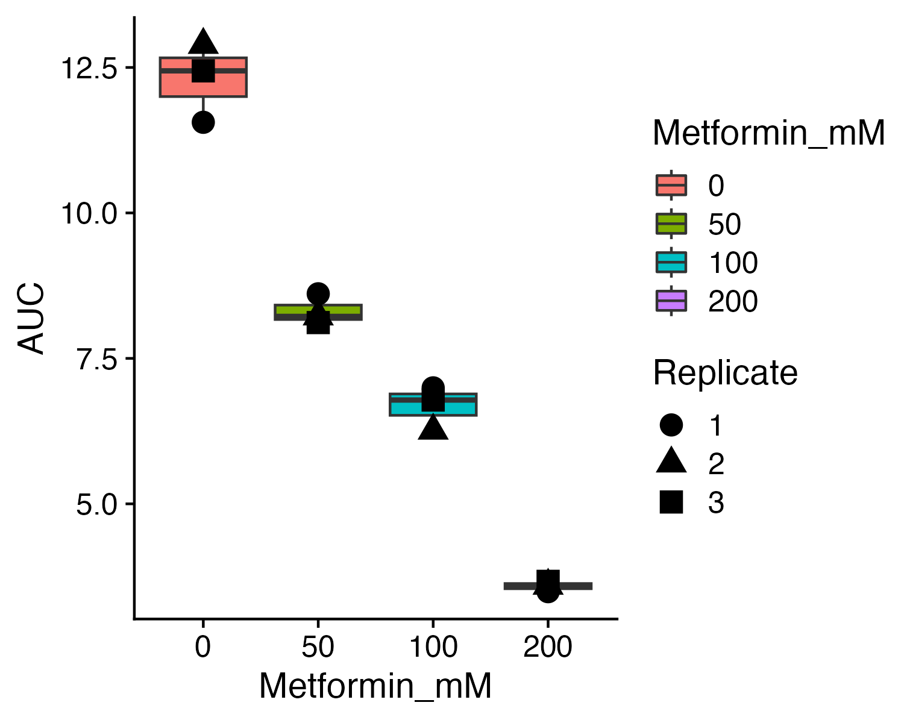

# Session 01 - Bacterial Growth Assay

## Data description

In this session, we will analyze a dataset consisting of an array of _E. coli_ strains that were grown under different metformin concentrations (0, 50, 100, and 200 mM). The original data was read using the Biospa machine in the lab, and the tables were summarized using an in-house Python script, [cell_dynamics](https://github.com/Cabreiro-Lab/cell_dynamics).

Given that we have several hundred strains at four conditions, each with triplicates, we will perform basic analyses on the data. For example, we will check the number of strains, conditions, and replicates per condition using R commands. After this, we will learn how to clean the data by filtering and transforming variables into a usable format. Finally, we will conclude the session by learning the basic steps of creating simple boxplots using ggplot2, and how to modify certain aspects of the plots to suit our needs.

The data looks like this once cleaned.

| **Well** | **Replicate** | **Metformin_mM** | **PG** | **Strain** | **AUC** |
|:---------|--------------:|-----------------:|-------:|:-----------|--------:|
| B2       |             1 |              200 |     10 | NT12534    |   0.488 |
| B3       |             1 |              200 |     10 | NT12540    |   0.004 |
| B4       |             1 |              200 |     10 | NT12546    |   0.961 |
| B5       |             1 |              200 |     10 | NT12557    |   0.012 |
| B6       |             1 |              200 |     10 | NT12010    |   3.510 |
| B7       |             1 |              200 |     10 | NT12016    |   0.257 |

During the course of the first session, we will learn:

-   What are vectors in R and how to index them
-   What are dataframes in R and how to index them
-   To use the basic functions from `dplyr` such as `filter` or `select`
-   How to make filter multiple items in the data using logical operators (`AND` and `OR`)
-   How to generate very simple dot plots and boxplots
-   A very brief introduction on how to modify the plot (e.g., labels, colours, font size...)

## Core Concepts

### Data Manipulation with `dplyr`

`dplyr` is a powerful R package that provides a set of tools for efficiently manipulating datasets. It is built around a few key functions, which we call verbs, that perform common data manipulation tasks.

-   **`select()`**: Picks variables based on their names.
    ```R
    # Selects the Strain, Metformin_mM, and AUC columns
    select(your_data, Strain, Metformin_mM, AUC)
    ```

-   **`filter()`**: Picks cases based on their values.
    ```R
    # Filters for rows where the strain is 'NT12534' and Metformin is 200mM
    filter(your_data, Strain == "NT12534", Metformin_mM == 200)
    ```

-   **`mutate()`**: Creates new variables with functions of existing variables.
    ```R
    # Creates a new column called AUC_log by taking the logarithm of AUC
    mutate(your_data, AUC_log = log(AUC))
    ```

-   **`group_by()`**: Groups the data by one or more variables. Most data manipulation operations are then performed on each group.
    ```R
    # Groups the data by Strain
    group_by(your_data, Strain)
    ```

-   **`summarise()`**: Reduces multiple values down to a single summary. It is most useful when combined with `group_by()`.
    ```R
    # Calculates the mean and standard deviation of AUC for each strain
    summarise(grouped_data, mean_AUC = mean(AUC), sd_AUC = sd(AUC))
    ```

### Data Visualization with `ggplot2`

`ggplot2` is a system for creating graphics based on the "Grammar of Graphics". This approach allows you to build complex plots by adding layers of data, aesthetics, and geometric shapes. This is one of the most powerful methods to create graphs, allowing you to fine-tune almost any part imaginable of any plot (given that you know how to do it). For an in-depth manual, look at this [book](https://ggplot2-book.org/) from Hadley Wickham. 

A plot in `ggplot2` has three essential components:
1.  **Data**: The dataset containing the variables you want to plot.
2.  **Aesthetics (`aes()`)**: How you map variables from your data to visual properties. For example, mapping the `Strain` to the x-axis and `AUC` to the y-axis.
3.  **Geometries (`geom_...()`)**: The geometric objects that represent your data (e.g., `geom_point()` for scatter plots, `geom_boxplot()` for boxplots).

Here is how you can build a boxplot layer by layer:
```R
# 1. Start with the data and aesthetics
p = ggplot(data = your_data, aes(x = Strain, y = AUC))

# 2. Add a geometric layer (boxplot)
p = p + geom_boxplot()

# 3. Add another layer (points)
p = p + geom_jitter(width = 0.2) # Jittered points to avoid overplotting

# 4. Add labels and a title
p = p + labs(title = "Bacterial Growth AUC",
             x = "Strain ID",
             y = "Area Under Curve (AUC)")

# 5. Customize the theme
p = p + theme_bw()

# To see the plot, just type the name of the variable 'p'
p
```

In the end you should be able to generate a plot similar to this:


## Repository Contents

### Code

-   `cleaned_session.R`: A consolidated and well-documented R script for the session. This script covers all the steps from data loading and cleaning to visualization and statistical analysis.
-   `bacterial_AUCs.R`: R script to calculate the Area Under the Curve (AUC) for bacterial growth curves (archived).
-   `session_02.R`: Main R script for the session, covering data loading, cleaning, and plotting (archived).
-   `session_02_invivo.R`: R script for in-vivo data analysis (archived).

### Data

-   `Design.xlsx`: Excel file with the experimental design.
-   `Output_595/`: Directory containing the summarized data in CSV format.
-   `input_files.zip`: Input files coming from a Biospa machine.
-   `pattern_files.zip`: Pattern files used by the Design file to map strains and other variables to wells.

### Plots

This directory contains the plots generated during the analysis, such as `boxplot_NT12060.png`.

### Tables

This directory contains tables generated during the analysis, such as `strains_stats.csv` and `summary_stats.csv`.
